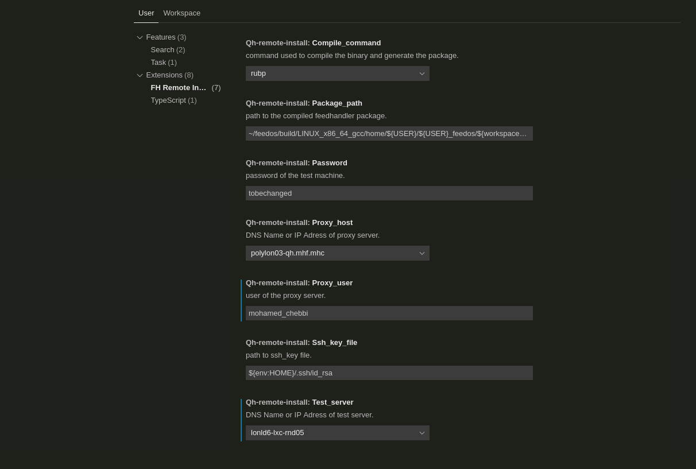
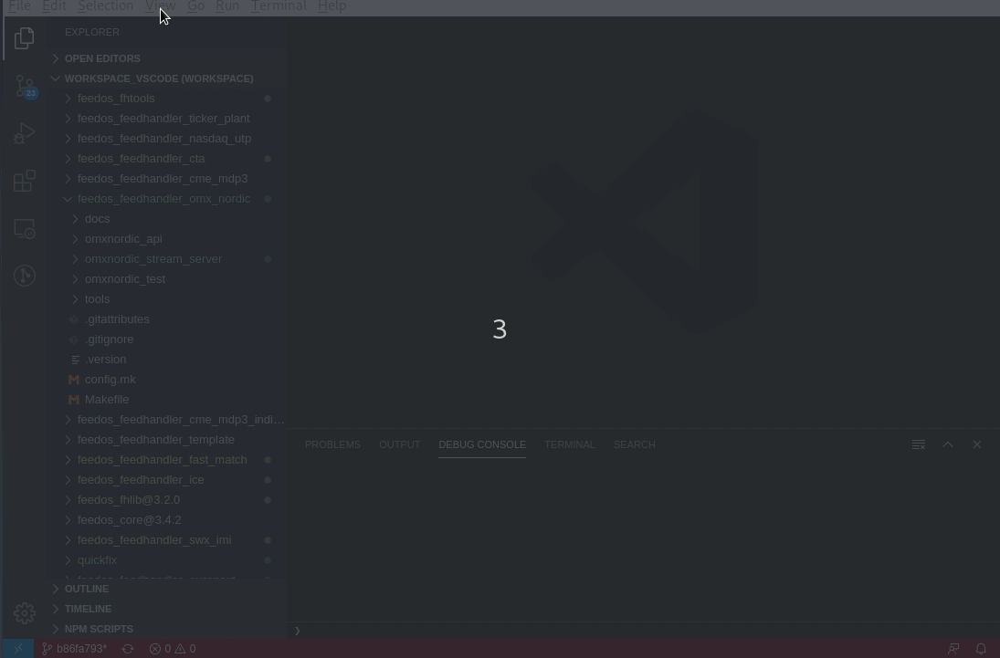
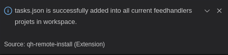
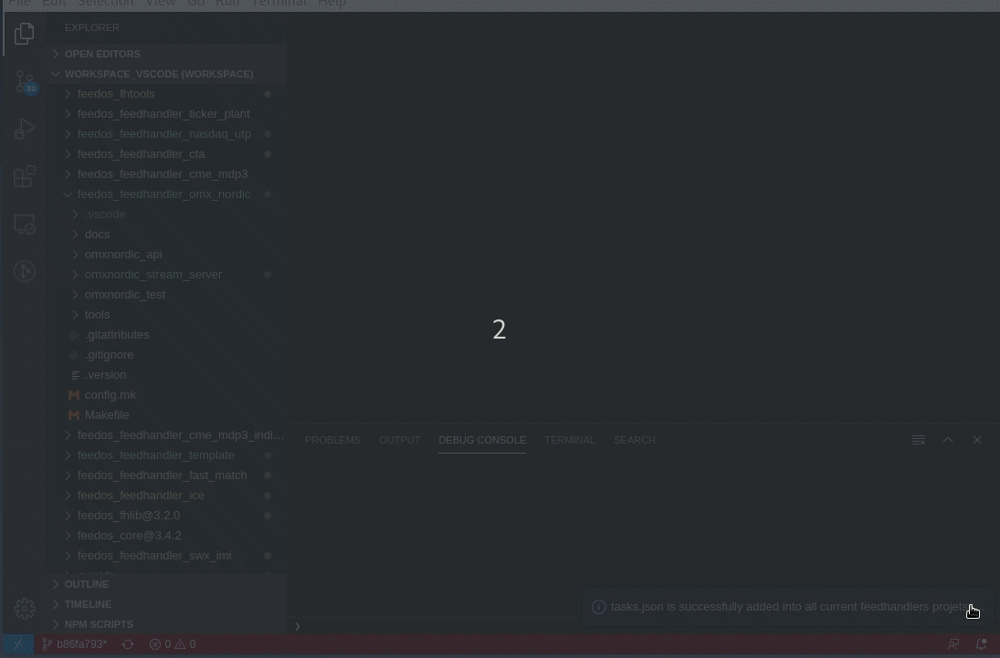
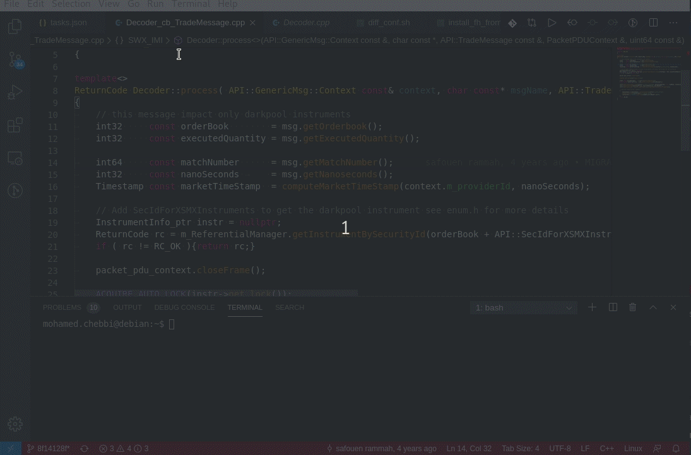
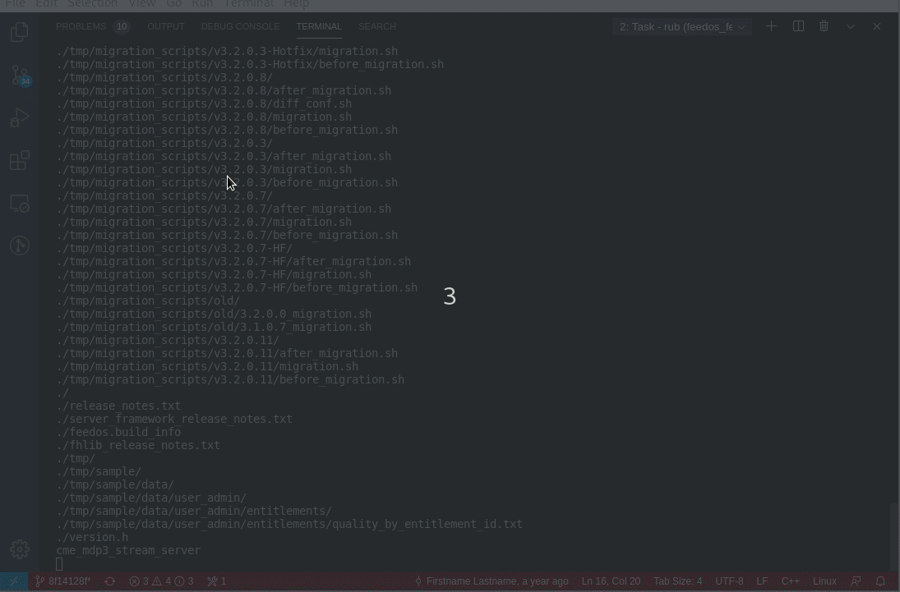
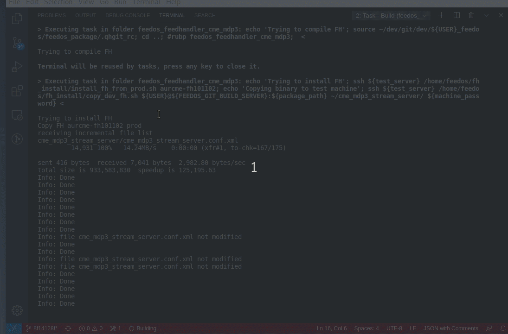
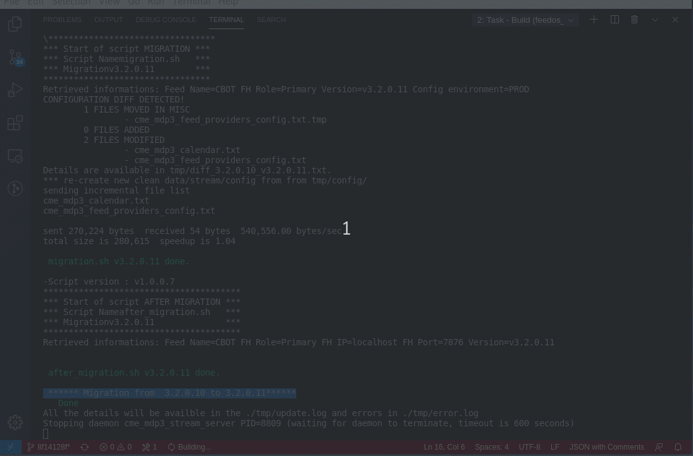

# FH-remote-install README

Basically, FH-remote-install will automate, for every feedhandler project in the active workspace the following:

* Compilation in test server
* Copy production instance of the feedhanler based on the choise of the user
* Upgarde the dev compiled version using the automatic steps of Quantflow

## Requirements

sshpass is required to use this extension.

## Extension Settings

Once the plugin installed, you need to check if default setting are good. (Cltr+,)

## How does It work

Open **Command Patette** (Cltr+Shift+P): and tape "Configure Remote Install"

If every thing is going well, you will see the following info message:

Check that in every project in the active workspace there is a new file created : .vscode/tasks.json

Now if you tape **Terminal->Run Build Task**(Cltr+Alt+B),you will see diffrents build for every project.

If we click on cme_mdp3, thebuild is lauched as follow and thecompilation began:

Once the compilation is done, A new list of production server is displayed,

In this demo, we choose the instance CME_CBOT_FUTURES_HW_SPEC:aurcme-fh101102

A copy of the production instance is installed on the rnd server.

Now steps of automatic Quantflow will be applied.

-----------------------------------------------------------------------------------------------------------
